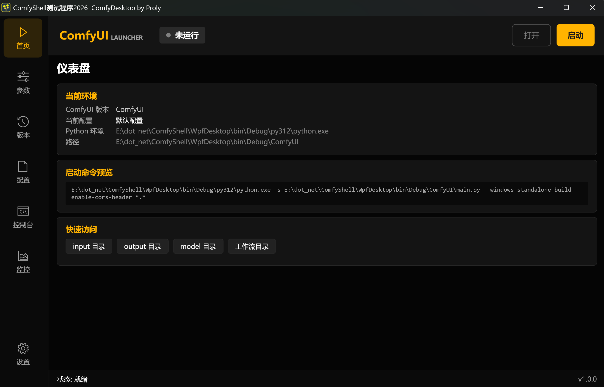

# ComfyShell 🚀

**ComfyShell** 是一个为 [ComfyUI](https://github.com/comfyanonymous/ComfyUI) 量身打造的现代化桌面启动管理工具。

基于 **.NET 10.0** 和 **WPF** 构建，采用 MVVM 架构，旨在简化 ComfyUI 的配置、版本管理、运行监控以及日常使用流程。




## ✨ 核心功能

*   **⚡ 多重配置管理 (Profile Management)**
    *   创建并保存多套启动配置（例如：低显存模式、高性能模式、CPU 模式）。
    *   一键切换不同的参数组合，无需手动修改批处理文件。

*   **🛠️ 深度参数配置**
    *   提供图形化界面配置 ComfyUI 的各种启动参数。
    *   支持 `VRAM Mode` (High/Low/Normal)、`Attention Mode`、`Precision` 等高级选项。
    *   自动构建并预览启动命令。

*   **📊 进程与硬件监控**
    *   **进程控制**：在应用内直接启动、停止和重启 ComfyUI。
    *   **实时日志**：内置控制台窗口查看 ComfyUI 的实时输出日志。
    *   **硬件仪表盘**：集成硬件监控功能，实时显示 CPU、GPU（显存/利用率）和内存状态，防止爆显存。

*   **📦 版本与环境管理**
    *   支持管理多个 ComfyUI 版本。
    *   集成 Git 功能，支持从 GitHub 克隆和更新 ComfyUI。
    *   自定义 Python 解释器路径。

*   **⏱️ 智能辅助**
    *   自动关机倒计时功能（适合长时间跑图场景）。

## 🏗️ 技术栈

本项目使用最新的微软技术栈构建，确保高性能与可维护性：

*   **框架**: .NET 10.0 (Windows Desktop)
*   **UI 框架**: WPF (Windows Presentation Foundation)
*   **架构模式**: MVVM (Model-View-ViewModel)
*   **核心库**:
    *   `CommunityToolkit.Mvvm`: 高效的 MVVM 工具包。
    *   `Microsoft.Extensions.DependencyInjection`: 依赖注入。
    *   `Microsoft.Extensions.Hosting`: 应用程序生命周期管理。
    *   `LibreHardwareMonitorLib`: 硬件传感器读取。

## 🚀 快速开始

### 环境要求

*   Windows 10 / 11 (x64)
*   [.NET 10.0 SDK](https://dotnet.microsoft.com/download/dotnet/10.0) 或更高版本
*   [ComfyUI](https://github.com/comfyanonymous/ComfyUI) (可通过本软件直接下载)
*   Python 3.10+ (推荐)

### 构建与运行

1.  **克隆仓库**
    ```bash
    git clone https://github.com/YourUsername/ComfyShell.git
    cd ComfyShell/WpfDesktop
    ```

2.  **构建项目**
    ```powershell
    dotnet build
    ```

3.  **运行**
    ```powershell
    dotnet run
    ```
    或者直接打开 `WpfDesktop.sln` 使用 Visual Studio 2022+ 进行调试。

## 📂 目录结构

```text
E:\dot_net\ComfyShell\WpfDesktop\
├── Models\             # 数据模型与枚举 (ComfyConfiguration, Profile...)
├── ViewModels\         # 视图模型 (MVVM 逻辑核心)
├── Views\              # XAML UI 界面
├── Services\           # 业务逻辑服务 (Process, Git, Hardware...)
├── Resources\          # 图标与样式资源
├── appsettings.json    # 全局应用配置
└── App.xaml.cs         # 依赖注入容器配置与入口
```

## 🤝 贡献指南

欢迎提交 Issue 和 Pull Request！

1.  Fork 本仓库
2.  创建你的特性分支 (`git checkout -b feature/AmazingFeature`)
3.  提交你的修改 (`git commit -m 'Add some AmazingFeature'`)
4.  推送到分支 (`git push origin feature/AmazingFeature`)
5.  开启一个 Pull Request

## 📄 许可证

[MIT License](LICENSE) (建议添加 LICENSE 文件)

---
*由 [Gemini CLI Agent](https://ai.google.dev/) 辅助生成*
